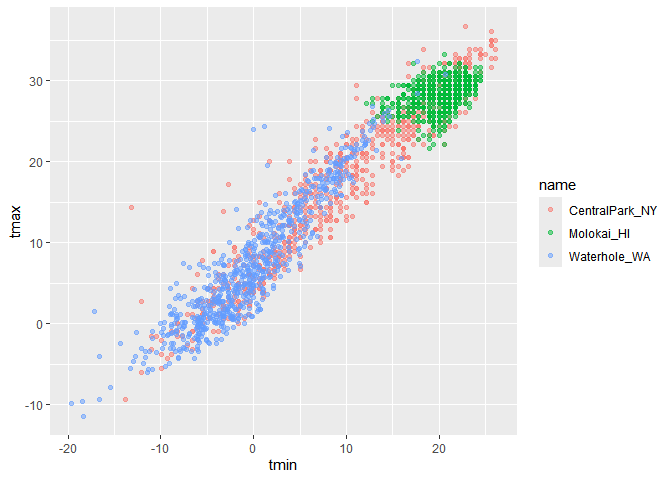
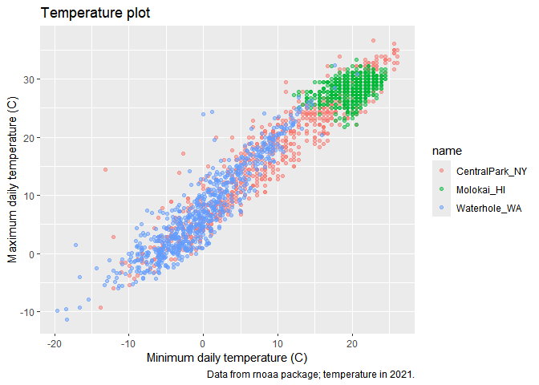
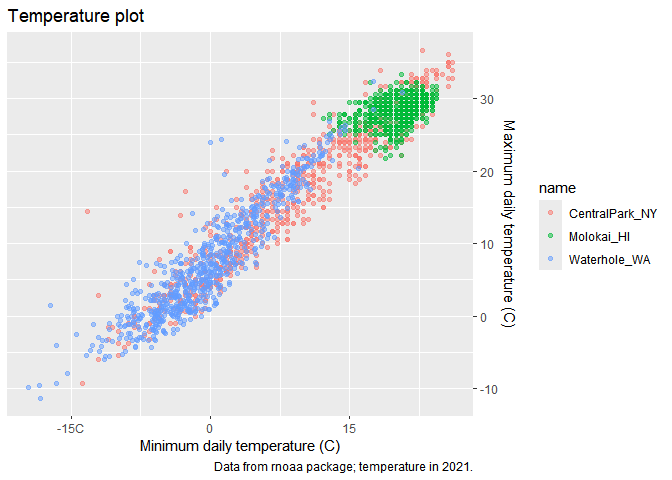
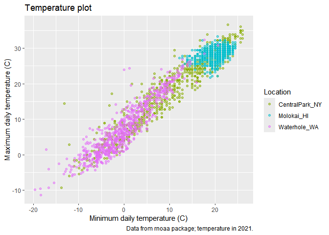
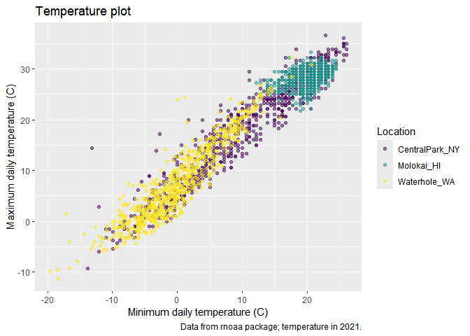

Visualization
================
2025-09-30

``` r
library(tidyverse)
```

    ## ── Attaching core tidyverse packages ──────────────────────── tidyverse 2.0.0 ──
    ## ✔ dplyr     1.1.4     ✔ readr     2.1.5
    ## ✔ forcats   1.0.0     ✔ stringr   1.5.1
    ## ✔ ggplot2   3.5.2     ✔ tibble    3.3.0
    ## ✔ lubridate 1.9.4     ✔ tidyr     1.3.1
    ## ✔ purrr     1.1.0     
    ## ── Conflicts ────────────────────────────────────────── tidyverse_conflicts() ──
    ## ✖ dplyr::filter() masks stats::filter()
    ## ✖ dplyr::lag()    masks stats::lag()
    ## ℹ Use the conflicted package (<http://conflicted.r-lib.org/>) to force all conflicts to become errors

``` r
library(patchwork)
```

# Load the weather data

``` r
library(p8105.datasets)
data("weather_df")
```

## Remember this plot…?

``` r
weather_df %>%
  ggplot(aes(x=tmin,y=tmax, color=name)) +
  geom_point(alpha = .5)
```

    ## Warning: Removed 17 rows containing missing values or values outside the scale range
    ## (`geom_point()`).

<!-- -->

## Lables

``` r
weather_df %>%
  ggplot(aes(x=tmin,y=tmax, color=name)) +
  geom_point(alpha = .5) +
  labs(
    title = "Temperature plot",
    x = "Minimum daily temperature (C)",
    y = "Maximum daily temperature (C)",
    caption = "Data from rnoaa package; temperature in 2021."
  )
```

    ## Warning: Removed 17 rows containing missing values or values outside the scale range
    ## (`geom_point()`).

<!-- -->

## Scales

Start with the same plot

``` r
weather_df %>%
  ggplot(aes(x=tmin,y=tmax, color=name)) +
  geom_point(alpha = .5) +
  labs(
    title = "Temperature plot",
    x = "Minimum daily temperature (C)",
    y = "Maximum daily temperature (C)",
    caption = "Data from rnoaa package; temperature in 2021."
  )+
  scale_x_continuous(
    breaks = c(-15, 0, 15),
    labels = c("-15C", "0", "15")
  )+
  scale_y_continuous(
    position = "right"
  )
```

    ## Warning: Removed 17 rows containing missing values or values outside the scale range
    ## (`geom_point()`).

<!-- -->

(可以在scale_y_continuous中使用`trans = "log"`将函数拟合进行转换)

Look at color scales

``` r
weather_df %>%
  ggplot(aes(x=tmin,y=tmax, color=name)) +
  geom_point(alpha = .5) +
  labs(
    title = "Temperature plot",
    x = "Minimum daily temperature (C)",
    y = "Maximum daily temperature (C)",
    caption = "Data from rnoaa package; temperature in 2021."
  )+
  scale_color_hue(
    name = "Location",
    h=c(100,300))
```

    ## Warning: Removed 17 rows containing missing values or values outside the scale range
    ## (`geom_point()`).

<!-- -->
(`name = "Location"`:修改颜色图例的标题;
`h=c(100,300)`:控制颜色的色相范围)

``` r
weather_df %>%
  ggplot(aes(x=tmin,y=tmax, color=name)) +
  geom_point(alpha = .5) +
  labs(
    title = "Temperature plot",
    x = "Minimum daily temperature (C)",
    y = "Maximum daily temperature (C)",
    caption = "Data from rnoaa package; temperature in 2021."
  )+
  viridis::scale_color_viridis(
    name = "Location",
    discrete = TRUE)
```

    ## Warning: Removed 17 rows containing missing values or values outside the scale range
    ## (`geom_point()`).

<!-- -->
(这里`color = name`，name是一个离散型变量，因此要加`discrete = TRUE`)
